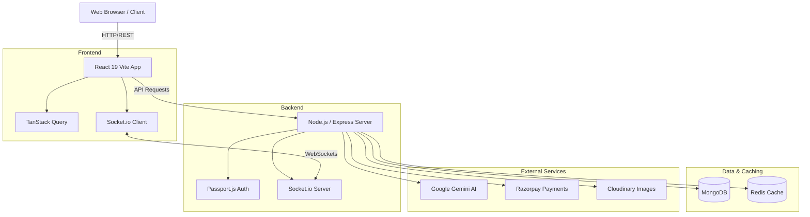
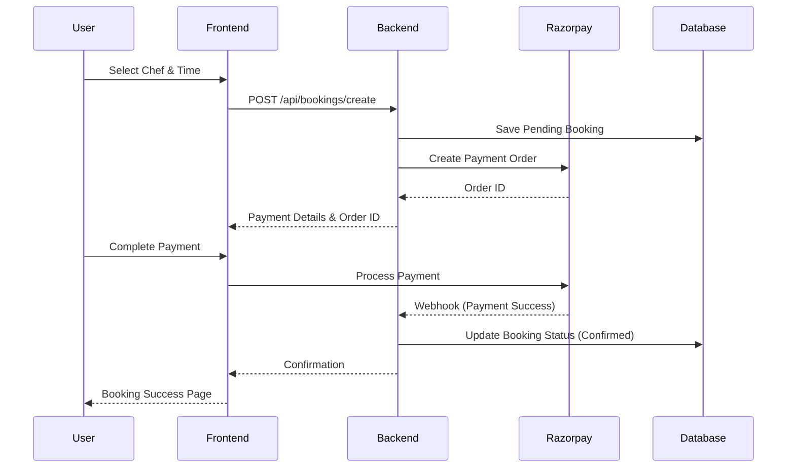
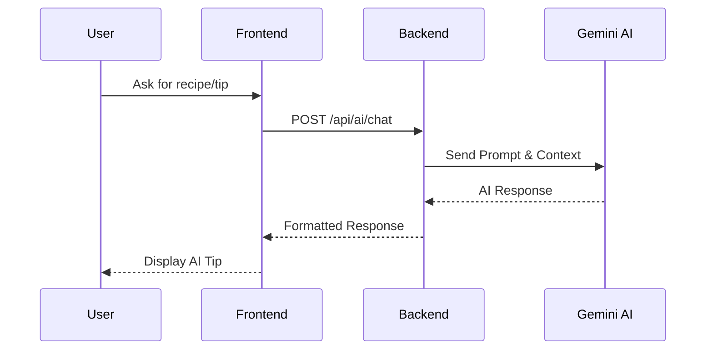
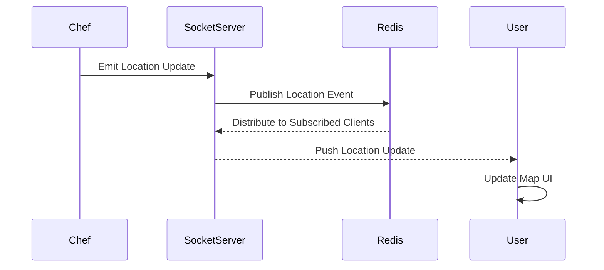

# Chefhub Architecture

This document outlines the high-level architecture and data flows of the Chefhub platform. It provides a visual understanding of how the various components interact with each other.

## System Architecture

The overall system architecture demonstrates the interaction between the frontend, backend, database, and external services.

## Booking Flow

The booking flow illustrates the steps taken from when a user selects a chef to the final payment confirmation.

## AI Chef Assistant Flow

This flow shows how the AI Assistant integrates with the Google Gemini API to provide smart culinary advice.

## Real-time Tracking Flow

This demonstrates how WebSocket connections are used to provide live updates of the chef's location to the user.

